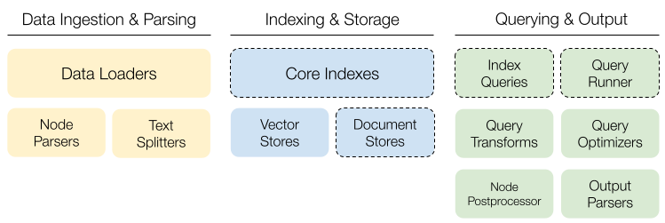

# 💡 Contributing to LlamaIndex

> ⚠️ **NOTE**: We are rebranding GPT Index as LlamaIndex! 
> **2/19/2023**: We are still in the middle of the transition. If you are interested in contributing to LlamaIndex, make sure to follow the below steps. For testing, please do `import gpt_index` instead of `import llama_index`.

Interested in contributing to LlamaIndex? Here's how to get started! 

## Contribution Guideline
The best part of LlamaIndex is our community of users and contributors.


### What should I work on?
- 🆕 Extend core modules
- 🐛 Fix bugs
- 🎉 Add usage examples
- 🧪 Add experimental features 
- 📄 Improve code quality & documentation

Also, join our Discord for ideas and discussions: https://discord.gg/dGcwcsnxhU.


### 🆕 Extend Core Modules
The most impactful way to contribute to LlamaIndex is extending our core modules:



We can roughly group the core modules into 3 categories:
1) data ingestion & parsing, 
2) indexing & storage, and 
3) querying & output.

We welcome contributions in _all_ modules shown above.
So far, we have focused on implementing a core set of functionalities for each.
As a contributor, you can help unlock the full potential.

We are making rapid improvement to the project, and as a result, 
some interfaces are still volatile.
> Specifically, we are actively working on making the components with dotted outline more modular (core indexes, document stores, index queries, query runner). So expect volatility.

#### Module Details
Below, we will describe what each module does, give a high-level idea of the interface, show existing implementations, and give some ideas for contribution.

#### Data Loaders
A data loader ingests data of any format from anywhere into `Documents`, which can then be parsed and indexed.

**Interface**: `load_data` takes arbitrary arguments as input (e.g. path to data), and outputs a sequence of `Documents`.


**Examples**:
* [Google Sheets Loader](https://github.com/emptycrown/llama-hub/tree/main/loader_hub/google_sheets)
* [Gmail Loader](https://github.com/emptycrown/llama-hub/tree/main/loader_hub/gmail)
* [Github Repository Loader](https://github.com/emptycrown/llama-hub/tree/main/loader_hub/github_repo)

Contributing a data loader is easy and super impactful for the community.
The preferred way to contribute is making a PR at [LlamaHub Github](https://github.com/emptycrown/llama-hub).

**Ideas**
* Want to load something but there's no LlamaHub data loader for it yet? Make a PR!

#### Node Parser
A node parser parses `Documents` into `Nodes` (atomic unit of data that LlamaIndex operates over, e.g., chunk of text, image, or table).
It is responsible for splitting text (via text splitters) and explicitly modelling the relationship between units of data (e.g. A is the source of B, C is a chunk after D).

**Interface**: `get_nodes_from_documents` takes a sequence of `Documents` as input, and outputs a sequence of `Nodes`.

**Examples**:
* [Simple Node Parser](https://github.com/jerryjliu/llama_index/blob/main/gpt_index/node_parser/simple.py)

See [reference](https://gpt-index.readthedocs.io/en/latest/reference/node_parser.html) for full details.

**Ideas**:
* Add new `Node` relationships to model to model hierarchical document (e.g. play-act-scene, chapter-section-heading).

#### Text Splitters
Text splitter splits a long text `str` into smaller text `str` chunks with desired size and strategy. This is important since LLMs have limited context window size, and the quality of text chunk used as context impacts the quality of query results.

**Interface**: `split_text` takes a `str` as input, and outputs a sequence of `str`

**Examples**:
* [Token Text Splitter](https://github.com/jerryjliu/llama_index/blob/main/gpt_index/langchain_helpers/text_splitter.py#L23)
* [Sentence Splitter](https://github.com/jerryjliu/llama_index/blob/main/gpt_index/langchain_helpers/text_splitter.py#L239)

#### Vector Stores
Vector store stores embeddings and supports lookup via similiarty.
These serve as the main data store and retrieval engine for our vector index.

**Interface**:
* `add` takes in a sequence of `NodeEmbeddingResults` and insert the embeddings (and possibly the node contents & metadata) into the vector store.
* `delete` removes entries given document IDs.
* `query` retrieves top-k most similar entries given a query embedding.

**Examples**:
* [Pinecone](https://github.com/jerryjliu/llama_index/blob/main/gpt_index/vector_stores/pinecone.py)
* [Faiss](https://github.com/jerryjliu/llama_index/blob/main/gpt_index/vector_stores/faiss.py)
* [Chroma](https://github.com/jerryjliu/llama_index/blob/main/gpt_index/vector_stores/chroma.py)

**Ideas**:
* See a vector database out there that we don't support yet? Make a PR!

See [reference](https://gpt-index.readthedocs.io/en/latest/reference/indices/vector_stores/stores.html) for full details.

#### Query Transforms
A query transform augments a raw query string with associated transformations to improve index querying.
This can interpreted as a pre-processing stage, before the core index query logic is executed.

**Interface**: `run` takes in a `str` or `Querybundle` as input, and outputs a transformed `QueryBundle`.

**Examples**:
* [Hypothetical Document Embeddings](https://github.com/jerryjliu/llama_index/blob/main/gpt_index/indices/query/query_transform/base.py#L77)
* [Decompose](https://github.com/jerryjliu/llama_index/blob/main/gpt_index/indices/query/query_transform/base.py#L124)

See [guide](https://gpt-index.readthedocs.io/en/latest/how_to/query/query_transformations.html#hyde-hypothetical-document-embeddings) for more information.
#### Token Usage Optimizers
A token usage optimizer refines the retrieved `Nodes` to reduce token usage during response synthesis.

**Interface**: `optimize` takes in the `QueryBundle` and a text chunk `str`, and outputs a refined text chunk `str` that yeilds a more optimized response

**Examples**:
* [Sentence Embedding Optimizer](https://github.com/jerryjliu/llama_index/blob/main/gpt_index/optimization/optimizer.py)

#### Node Postprocessors
A node postprocessor refines a list of retrieve nodes given configuration and context.

**Interface**: `postprocess_nodes` takes a list of `Nodes` and extra metadata (e.g. similarity and query), and outputs a refined list of `Nodes`.


**Examples**:
* [Keyword Postprocessor](https://github.com/jerryjliu/llama_index/blob/main/gpt_index/indices/postprocessor/node.py#L32): filters nodes based on keyword match
* [Similarity Postprocessor](https://github.com/jerryjliu/llama_index/blob/main/gpt_index/indices/postprocessor/node.py#L62): filers nodes based on similarity threshold
* [Prev Next Postprocessor](https://github.com/jerryjliu/llama_index/blob/main/gpt_index/indices/postprocessor/node.py#L135): fetchs additional nodes to augment context based on node relationships.

#### Output Parsers
A output parser enables us to extract structured output from the plain text output generated by the LLM.

**Interface**:
* `format`: formats a query `str` with structured output formatting instructions, and outputs the formatted `str` 
* `parse`: takes a `str` (from LLM response) as input, and gives a parsed tructured output (optionally also validated, error-corrected).

**Examples**:
* [Guardrails Output Parser](https://github.com/jerryjliu/llama_index/blob/main/gpt_index/output_parsers/guardrails.py)
* [Langchain Output Parser](https://github.com/jerryjliu/llama_index/blob/main/gpt_index/output_parsers/langchain.py)

See [guide](https://gpt-index.readthedocs.io/en/latest/how_to/output_parsing.html) for more information.

### Fix Bugs
Most bugs are reported and tracked in [Github Issues Page](https://github.com/jerryjliu/gpt_index/issues).
We try our best in triaging and tagging the issues.
Issues tagged as `bug` are confirmed bugs. 
New contributors may want to start with `good first issue`.
Please feel free to open an issue and/or assign an issue to yourself.
### Add Usage Examples
Todo.

### Add Experimental Features
If you have an crazy idea, make a PR for it! 
Whether if it's the latest research, or what you thought of in the shower, we'd love to see creative ways to improve LlamaIndex.

### Improve Code Quality & Documentation
Todo.

## Development Guideline
### Environment Setup

LlamaIndex is a Python package. We've tested primarily with Python versions >= 3.8. Here's a quick
and dirty guide to getting your environment setup.

First, create a fork of LlamaIndex, by clicking the "Fork" button on the [LlamaIndex Github page](https://github.com/jerryjliu/gpt_index).
Following [these steps](https://docs.github.com/en/get-started/quickstart/fork-a-repo) for more details
on how to fork the repo and clone the forked repo.

Then, create a new Python virtual environment. The command below creates an environment in `.venv`,
and activates it:
```bash
python -m venv .venv
source .venv/bin/activate
```

Install the required dependencies (this will also install gpt-index through `pip install -e .` 
so that you can start developing on it):

```bash
pip install -r requirements.txt
```

Now you should be set! 


### Validating your Change

Let's make sure to `format/lint` our change. For bigger changes,
let's also make sure to `test` it and perhaps create an `example notebook`.

#### Formatting/Linting

You can format and lint your changes with the following commands in the root directory:

```bash
make format; make lint
```

You can also make use of our pre-commit hooks by setting up git hook scripts:

```bash
pre-commit install
```

We run an assortment of linters: `black`, `ruff`, `mypy`.

#### Testing

For bigger changes, you'll want to create a unit test. Our tests are in the `tests` folder.
We use `pytest` for unit testing. To run all unit tests, run the following in the root dir:

```bash
pytest tests
```

### Creating an Example Notebook

For changes that involve entirely new features, it may be worth adding an example Jupyter notebook to showcase
this feature. 

Example notebooks can be found in this folder: https://github.com/jerryjliu/gpt_index/tree/main/examples.


### Creating a pull request

See [these instructions](https://docs.github.com/en/pull-requests/collaborating-with-pull-requests/proposing-changes-to-your-work-with-pull-requests/creating-a-pull-request-from-a-fork)
to open a pull request against the main LlamaIndex repo.


