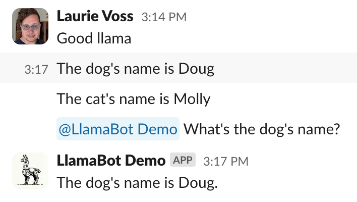

# Starter Tools

We have created a variety of open-source tools to help you bootstrap your generative AI projects.

## create-llama: Full-stack web application generator

The `create-llama` tool is a CLI tool that helps you create a full-stack web application with your choice of frontend and backend that indexes your documents and allows you to chat with them. Running it is as simple as running:

```shell
npx create-llama@latest
```

For full documentation, check out the [create-llama README on npm](https://www.npmjs.com/package/create-llama).

## SEC Insights: advanced query techniques

Indexing and querying financial filings is a very common use-case for generative AI. To help you get started, we have created and open-sourced a full-stack application that lets you select filings from public companies across multiple years and summarize and compare them. It uses advanced querying and retrieval techniques to achieve high quality results.

You can use the app yourself at [SECinsights.ai](https://www.secinsights.ai/) or check out the code on [GitHub](https://github.com/run-llama/sec-insights).


## Chat LlamaIndex: Full-stack chat application

Chat LlamaIndex is another full-stack, open-source application that has a variety of interaction modes including streaming chat and multi-modal querying over images. It's a great way to see advanced chat application techniques. You can use it at [chat.llamaindex.ai](https://chat.llamaindex.ai/) or check out the code on [GitHub](https://github.com/run-llama/chat-llamaindex).


## LlamaBot: Slack and Discord apps

LlamaBot is another open-source application, this time for building a Slack bot that listens to messages within your organization and answers questions about what's going on. You can check out the [full tutorial and code on GitHub](https://github.com/run-llama/llamabot). If you prefer Discord, there is a [Discord version contributed by the community](https://twitter.com/clusteredbytes/status/1754220009885163957).



## RAG CLI: quick command-line chat with any document

We provide a command-line tool that quickly lets you chat with documents. Learn more in the [RAG CLI documentation](rag_cli.md).
