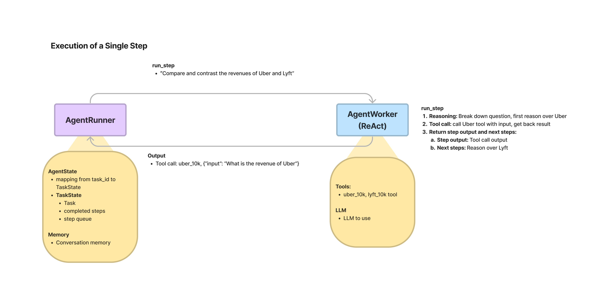

# Lower-Level Agent API

We offer a lower-level agent API that offers a host of capabilities beyond simply executing a user query end-to-end.

These capabilities let you step through and control the agent in a much more granular fashion. The end goal is that you can create **reliable** agentic software systems over your data.

We took inspiration from the [Agent Protocol](https://agentprotocol.ai/), the [OpenAI Assistants API](https://platform.openai.com/docs/assistants/overview), and of course a host of [agent](https://arxiv.org/abs/2210.03629) [research](https://arxiv.org/abs/2305.18323) [papers](https://arxiv.org/abs/2312.04511).

**NOTE**: This is still under development, so interfaces may change. In fact, we'd love to get your feedback on how to make this better.

## High-Level Agent Architecture

Our "agents" are composed of `AgentRunner` objects that interact with `AgentWorkers`:

- `AgentRunner`s are orchestrators that store state (including conversational memory), create and maintain tasks, run steps through each task, and offer the user-facing, high-level interface for users to interact with.
- `AgentWorker`s **control the step-wise execution of a Task**. Given an input step, an agent worker is responsible for generating the next step. They can be initialized with parameters and act upon state passed down from the Task/TaskStep objects, but do not inherently store state themselves. The outer `AgentRunner` is responsible for calling an `AgentWorker` and collecting/aggregating the results.

Some auxiliary classes:

- `Task`: high-level task, takes in a user query + passes along other info like memory
- `TaskStep`: represents a single step. Feed this in as input to `AgentWorker`, get back a `TaskStepOutput`. Completing a `Task` can involve multiple `TaskStep`.
- `TaskStepOutput`: Output from a given step execution. Outputs whether or not a task is done.



## Benefits

Here are some key benefits to using this lower-level API:

- Decouple task creation from execution - control when you want to execute a given task.
- Get greater debuggability into the execution of each step.
- Get greater visibility: view completed steps and next steps.
- [Coming Soon] Steerability: directly control/modify intermediate steps by injecting human feedback
- Abandon task: give up if a task has derailed throughout the course of execution, without affecting the core agent memory.
- [Coming Soon] Undoing a step.
- Easier Customization: it's easy to subclass/implement new agent algorithms (incl. ReAct, OpenAI, but also plan+solve, LLMCompiler) by implementing an `AgentWorker`.

## Usage Pattern

You can either use an `OpenAIAgent` or `ReActAgent`, or create your own via the `AgentRunner` and `AgentWorker`:

```python
from llama_index.core.agent import AgentRunner
from llama_index.agent.openai import OpenAIAgentWorker

# construct OpenAIAgent from tools
openai_step_engine = OpenAIAgentWorker.from_tools(tools, llm=llm, verbose=True)
agent = AgentRunner(openai_step_engine)

# create task
task = agent.create_task("What is (121 * 3) + 42?")

# execute step
step_output = agent.run_step(task)

# if step_output is done, finalize response
if step_output.is_last:
    response = agent.finalize_response(task.task_id)

# list tasks
task.list_tasks()

# get completed steps
task.get_completed_steps(task.task_id)

print(str(response))
```

**NOTE**: The older legacy implementations of `OpenAIAgent` and `ReActAgent` (which did not allow for step-wise execution) are still available via:

```python
from llama_index.core.agent import OldOpenAIAgent, OldReActAgent
```

## Additional Module Guides

Check out our lower-level [agent module guides](./modules.md#custom-agents) for more details!
