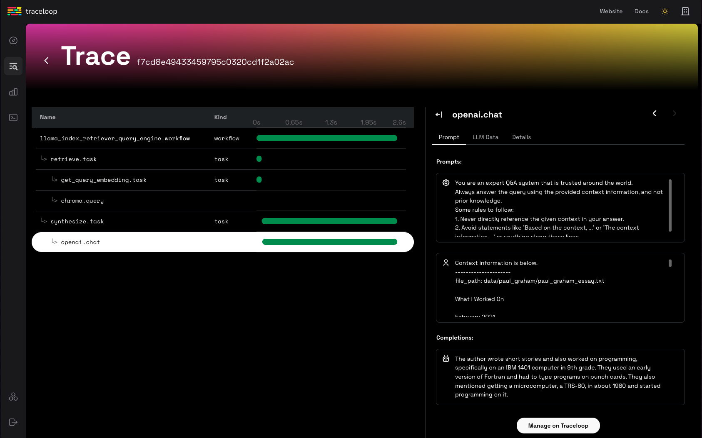
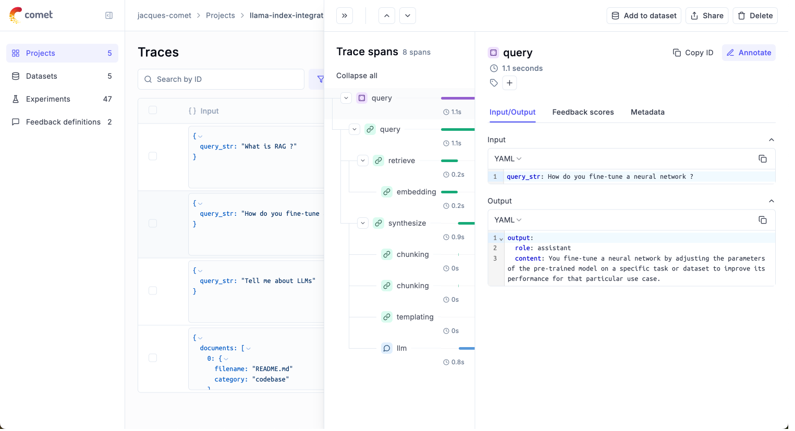

# Observability

LlamaIndex provides **one-click observability** 🔭 to allow you to build principled LLM applications in a production setting.

A key requirement for principled development of LLM applications over your data (RAG systems, agents) is being able to observe, debug, and evaluate
your system - both as a whole and for each component.

This feature allows you to seamlessly integrate the LlamaIndex library with powerful observability/evaluation tools offered by our partners.
Configure a variable once, and you'll be able to do things like the following:

- View LLM/prompt inputs/outputs
- Ensure that the outputs of any component (LLMs, embeddings) are performing as expected
- View call traces for both indexing and querying

Each provider has similarities and differences. Take a look below for the full set of guides for each one!

**NOTE:**

Observability is now being handled via the [`instrumentation` module](./instrumentation.md) (available in v0.10.20 and later.)

A lot of the tooling and integrations mentioned in this page use our legacy `CallbackManager` or don't use `set_global_handler`. We've marked these integrations as such!

## Usage Pattern

To toggle, you will generally just need to do the following:

```python
from llama_index.core import set_global_handler

# general usage
set_global_handler("<handler_name>", **kwargs)
```

Note that all `kwargs` to `set_global_handler` are passed to the underlying callback handler.

And that's it! Executions will get seamlessly piped to downstream service and you'll be able to access features such as viewing execution traces of your application.

## Partner `One-Click` Integrations

### LlamaTrace (Hosted Arize Phoenix)

We've partnered with Arize on [LlamaTrace](https://llamatrace.com/), a hosted tracing, observability, and evaluation platform that works natively with LlamaIndex open-source users and has integrations with LlamaCloud.

This is built upon the open-source Arize [Phoenix](https://github.com/Arize-ai/phoenix) project. Phoenix provides a notebook-first experience for monitoring your models and LLM Applications by providing:

- LLM Traces - Trace through the execution of your LLM Application to understand the internals of your LLM Application and to troubleshoot problems related to things like retrieval and tool execution.
- LLM Evals - Leverage the power of large language models to evaluate your generative model or application's relevance, toxicity, and more.

#### Usage Pattern

To install the integration package, do `pip install -U llama-index-callbacks-arize-phoenix`.

Then create an account on LlamaTrace: https://llamatrace.com/login. Create an API key and put it in the `PHOENIX_API_KEY` variable below.

Then run the following code:

```python
# Phoenix can display in real time the traces automatically
# collected from your LlamaIndex application.
# Run all of your LlamaIndex applications as usual and traces
# will be collected and displayed in Phoenix.

# setup Arize Phoenix for logging/observability
import llama_index.core
import os

PHOENIX_API_KEY = "<PHOENIX_API_KEY>"
os.environ["OTEL_EXPORTER_OTLP_HEADERS"] = f"api_key={PHOENIX_API_KEY}"
llama_index.core.set_global_handler(
    "arize_phoenix", endpoint="https://llamatrace.com/v1/traces"
)

...
```

#### Guides

- [LlamaCloud Agent with LlamaTrace](https://github.com/run-llama/llamacloud-demo/blob/main/examples/tracing/llamacloud_tracing_phoenix.ipynb)


### MLflow

[MLflow](https://mlflow.org/docs/latest/llms/tracing/index.html) is an open-source MLOps/LLMOps platform, focuses on the full lifecycle for machine learning projects, ensuring that each phase is manageable, traceable, and reproducible.
**MLflow Tracing** is an OpenTelemetry-based tracing capability and supports one-click instrumentation for LlamaIndex applications.

#### Usage Pattern

Since MLflow is open-source, you can start using it without any account creation or API key setup. Jump straight into the code after installing the MLflow package!

```python
import mlflow

mlflow.llama_index.autolog()  # Enable mlflow tracing
```


#### Guides

MLflow LlamaIndex integration also provides experiment tracking, evaluation, dependency management, and more. Check out the [MLflow documentation](https://mlflow.org/docs/latest/llms/llama-index/index.html) for more details.

#### Support Table

MLflow Tracing support the full range of LlamaIndex features. Some new features like [AgentWorkflow](https://www.llamaindex.ai/blog/introducing-agentworkflow-a-powerful-system-for-building-ai-agent-systems) requires MLflow >= 2.18.0.

| Streaming | Async | Engine | Agents | Workflow | AgentWorkflow |
| --- | --- | --- | --- | --- | --- |
| ✅ |  ✅ | ✅ | ✅ | ✅ (>= 2.18) | ✅  (>= 2.18) |


### OpenLLMetry

[OpenLLMetry](https://github.com/traceloop/openllmetry) is an open-source project based on OpenTelemetry for tracing and monitoring
LLM applications. It connects to [all major observability platforms](https://www.traceloop.com/docs/openllmetry/integrations/introduction) and installs in minutes.

#### Usage Pattern

```python
from traceloop.sdk import Traceloop

Traceloop.init()
```

#### Guides

- [OpenLLMetry](../../examples/callbacks/OpenLLMetry.ipynb)



### Arize Phoenix (local)

You can also choose to use a **local** instance of Phoenix through the open-source project.

In this case you don't need to create an account on LlamaTrace or set an API key for Phoenix. The phoenix server will launch locally.

#### Usage Pattern

To install the integration package, do `pip install -U llama-index-callbacks-arize-phoenix`.

Then run the following code:

```python
# Phoenix can display in real time the traces automatically
# collected from your LlamaIndex application.
# Run all of your LlamaIndex applications as usual and traces
# will be collected and displayed in Phoenix.

import phoenix as px

# Look for a URL in the output to open the App in a browser.
px.launch_app()
# The App is initially empty, but as you proceed with the steps below,
# traces will appear automatically as your LlamaIndex application runs.

import llama_index.core

llama_index.core.set_global_handler("arize_phoenix")
...
```

#### Example Guides

- [Auto-Retrieval Guide with Pinecone and Arize Phoenix](https://docs.llamaindex.ai/en/latest/examples/vector_stores/pinecone_auto_retriever/?h=phoenix)
- [Arize Phoenix Tracing Tutorial](https://colab.research.google.com/github/Arize-ai/phoenix/blob/main/tutorials/tracing/llama_index_tracing_tutorial.ipynb)

### Langfuse 🪢

[Langfuse](https://langfuse.com/docs) is an open source LLM engineering platform to help teams collaboratively debug, analyze and iterate on their LLM Applications. With the Langfuse integration, you can track and monitor performance, traces, and metrics of your LlamaIndex application. Detailed [traces](https://langfuse.com/docs/tracing) of the context augmentation and the LLM querying processes are captured and can be inspected directly in the Langfuse UI.

#### Usage Pattern

Make sure you have both `llama-index` and `langfuse` installed.

```bash
pip install llama-index langfuse
```

At the root of your LlamaIndex application, register Langfuse's `LlamaIndexInstrumentor`. When instantiating `LlamaIndexInstrumentor`, make sure to configure your Langfuse API keys and the Host URL correctly via environment variables or constructor arguments.

```python
import os

# Get keys for your project from the project settings page: https://cloud.langfuse.com
os.environ["LANGFUSE_PUBLIC_KEY"] = "pk-lf-..."
os.environ["LANGFUSE_SECRET_KEY"] = "sk-lf-..."
os.environ["LANGFUSE_HOST"] = "https://cloud.langfuse.com"  # 🇪🇺 EU region
# os.environ["LANGFUSE_HOST"] = "https://us.cloud.langfuse.com" # 🇺🇸 US region
```

```python
from langfuse.llama_index import LlamaIndexInstrumentor

# Get your keys from the Langfuse project settings page and set them as environment variables
# or pass them as arguments when initializing the instrumentor

instrumentor = LlamaIndexInstrumentor()

# Automatically trace all LlamaIndex operations
instrumentor.start()

# ... your LlamaIndex index creation ...
index.as_query_engine().query("What is the capital of France?")

# Flush events to langfuse
instrumentor.flush()
```

You can now see the logs of your LlamaIndex application in Langfuse:

[LlamaIndex example trace](https://langfuse.com/images/cookbook/integration-llamaindex-workflows/llamaindex-trace.gif)

_[Example trace link in Langfuse](https://cloud.langfuse.com/project/cloramnkj0002jz088vzn1ja4/traces/6f554d6b-a2bc-4fba-904f-aa54de2897ca?display=preview)_

#### Example Guides

- [Langfuse Documentation](https://langfuse.com/docs/integrations/llama-index/get-started)
- [End-to-end example notebook](https://langfuse.com/docs/integrations/llama-index/example-python-instrumentation-module)
- [Tracing LlamaIndex Agents](https://langfuse.com/docs/integrations/llama-index/workflows)
- [Analyze and Debug LlamaIndex Applications with PostHog and Langfuse](https://docs.llamaindex.ai/en/stable/examples/observability/LangfuseMistralPostHog/)

### Literal AI

[Literal AI](https://literalai.com/) is the go-to LLM evaluation and observability solution, enabling engineering and product teams to ship LLM applications reliably, faster and at scale. This is possible through a collaborative development cycle involving prompt engineering, LLM observability, LLM evaluation and LLM monitoring. Conversation Threads and Agent Runs can be automatically logged on Literal AI.

The simplest way to get started and try out Literal AI is to signup on our [cloud instance](https://cloud.getliteral.ai/).
You can then navigate to **Settings**, grab your API key, and start logging!

#### Usage Pattern

- Install the Literal AI Python SDK with `pip install literalai`
- On your Literal AI project, go to **Settings** and grab your API key
- If you are using a self-hosted instance of Literal AI, also make note of its base URL

Then add the following lines to your applicative code :

```python
from llama_index.core import set_global_handler

# You should provide your Literal AI API key and base url using the following environment variables:
# LITERAL_API_KEY, LITERAL_API_URL
set_global_handler("literalai")
```

#### Example Guides

- [Literal AI integration with Llama Index](https://docs.getliteral.ai/integrations/llama-index)
- [Build a Q&A application with LLamaIndex and monitor it with Literal AI](https://github.com/Chainlit/literal-cookbook/blob/main/python/llamaindex-integration)


### Comet Opik

[Opik](https://www.comet.com/docs/opik/?utm_source=llama-index&utm_medium=docs&utm_campaign=opik&utm_content=home_page) is an open-source end to end LLM Evaluation Platform built by Comet.

To get started, simply sign up for an account on [Comet](https://www.comet.com/signup?from=llm&utm_medium=github&utm_source=llama-index&utm_campaign=opik) and grab your API key.

#### Usage Pattern

- Install the Opik Python SDK with `pip install opik`
- In Opik, get your API key from the user menu.
- If you are using a self-hosted instance of Opik, also make note of its base URL.

You can configure Opik using the environment variables `OPIK_API_KEY`, `OPIK_WORKSPACE` and `OPIK_URL_OVERRIDE` if you are using a [self-hosted instance](https://www.comet.com/docs/opik/self-host/self_hosting_opik). You can set these by calling:

```bash
export OPIK_API_KEY="<OPIK_API_KEY>"
export OPIK_WORKSPACE="<OPIK_WORKSPACE - Often the same as your API key>"

# Optional
#export OPIK_URL_OVERRIDE="<OPIK_URL_OVERRIDE>"
```

You can now use the Opik integration with LlamaIndex by setting the global handler:

```python
from llama_index.core import Document, VectorStoreIndex, set_global_handler

# You should provide your OPIK API key and Workspace using the following environment variables:
# OPIK_API_KEY, OPIK_WORKSPACE
set_global_handler(
    "opik",
)

# This example uses OpenAI by default so don't forget to set an OPENAI_API_KEY
index = VectorStoreIndex.from_documents([Document.example()])
query_engine = index.as_query_engine()

questions = [
    "Tell me about LLMs",
    "How do you fine-tune a neural network ?",
    "What is RAG ?",
]

for question in questions:
    print(f"> \033[92m{question}\033[0m")
    response = query_engine.query(question)
    print(response)
```

You will see the following traces in Opik:



#### Example Guides

- [Llama-index + Opik documentation page](https://www.comet.com/docs/opik/tracing/integrations/llama_index?utm_source=llamaindex&utm_medium=docs&utm_campaign=opik)
- [Llama-index integration cookbook](https://www.comet.com/docs/opik/cookbook/llama-index?utm_source=llama-index&utm_medium=docs&utm_campaign=opik)

### Argilla

[Argilla](https://github.com/argilla-io/argilla) is a collaboration tool for AI engineers and domain experts who need to build high-quality datasets for their projects.

To get started, you need to deploy the Argilla server. If you have not done so, you can easily deploy it following this [guide](https://docs.argilla.io/latest/getting_started/quickstart/).

#### Usage Pattern

- Install the Argilla LlamaIndex integration package with `pip install argilla-llama-index`
- Initialize the ArgillaHandler. The `<api_key>` is in the `My Settings` page of your Argilla Space but make sure you are logged in with the `owner` account you used to create the Space. The `<api_url>` is the URL shown in your browser.
- Add the ArgillaHandler to the dispatcher.

```python
from llama_index.core.instrumentation import get_dispatcher
from argilla_llama_index import ArgillaHandler

argilla_handler = ArgillaHandler(
    dataset_name="query_llama_index",
    api_url="http://localhost:6900",
    api_key="argilla.apikey",
    number_of_retrievals=2,
)
root_dispatcher = get_dispatcher()
root_dispatcher.add_span_handler(argilla_handler)
root_dispatcher.add_event_handler(argilla_handler)
```

#### Example Guides

- [Getting started with Argilla's LlamaIndex Integration](https://github.com/argilla-io/argilla-llama-index/blob/main/docs/tutorials/getting_started.ipynb)
- [Other example tutorials](https://github.com/argilla-io/argilla-llama-index/tree/main/docs/tutorials)


## Other Partner `One-Click` Integrations (Legacy Modules)

These partner integrations use our legacy `CallbackManager` or third-party calls.

### Langfuse

This integration is deprecated. We recommend using the new instrumentation-based integration with Langfuse as described [here](https://langfuse.com/docs/integrations/llama-index/get-started).

#### Usage Pattern

```python
from llama_index.core import set_global_handler

# Make sure you've installed the 'llama-index-callbacks-langfuse' integration package.

# NOTE: Set your environment variables 'LANGFUSE_SECRET_KEY', 'LANGFUSE_PUBLIC_KEY' and 'LANGFUSE_HOST'
# as shown in your langfuse.com project settings.

set_global_handler("langfuse")
```

#### Guides

- [Langfuse Callback Handler](../../examples/observability/LangfuseCallbackHandler.ipynb)
- [Langfuse Tracing with PostHog](../../examples/observability/LangfuseMistralPostHog.ipynb)


### DeepEval

[DeepEval (by Confident AI)](https://github.com/confident-ai/deepeval) is an open-source evaluation framework for LLM applications. As you "unit test" your LLM app using DeepEval's 14+ default metrics it currently offers (summarization, hallucination, answer relevancy, faithfulness, RAGAS, etc.), you can debug failing test cases through this tracing integration with LlamaIndex, or debug unsatisfactory evaluations in **production** through DeepEval's hosted evaluation platform, [Confident AI](https://confident-ai.com), that runs referenceless evaluations in production.

#### Usage Pattern

```python
from llama_index.core import set_global_handler

set_global_handler("deepeval")

# NOTE: Run 'deepeval login' in the CLI to log traces on Confident AI, DeepEval's hosted evaluation platform.
# Run all of your LlamaIndex applications as usual and traces
# will be collected and displayed on Confident AI whenever evaluations are ran.
...
```


### Weights and Biases Prompts

Prompts allows users to log/trace/inspect the execution flow of LlamaIndex during index construction and querying. It also allows users to version-control their indices.

#### Usage Pattern

```python
from llama_index.core import set_global_handler

set_global_handler("wandb", run_args={"project": "llamaindex"})

# NOTE: No need to do the following
from llama_index.callbacks.wandb import WandbCallbackHandler
from llama_index.core.callbacks import CallbackManager
from llama_index.core import Settings

# wandb_callback = WandbCallbackHandler(run_args={"project": "llamaindex"})
# Settings.callback_manager = CallbackManager([wandb_callback])

# access additional methods on handler to persist index + load index
import llama_index.core

# persist index
llama_index.core.global_handler.persist_index(graph, index_name="my_index")
# load storage context
storage_context = llama_index.core.global_handler.load_storage_context(
    artifact_url="ayut/llamaindex/my_index:v0"
)
```


#### Guides

- [Wandb Callback Handler](../../examples/callbacks/WandbCallbackHandler.ipynb)

### OpenInference

[OpenInference](https://github.com/Arize-ai/open-inference-spec) is an open standard for capturing and storing AI model inferences. It enables experimentation, visualization, and evaluation of LLM applications using LLM observability solutions such as [Phoenix](https://github.com/Arize-ai/phoenix).

#### Usage Pattern

```python
import llama_index.core

llama_index.core.set_global_handler("openinference")

# NOTE: No need to do the following
from llama_index.callbacks.openinference import OpenInferenceCallbackHandler
from llama_index.core.callbacks import CallbackManager
from llama_index.core import Settings

# callback_handler = OpenInferenceCallbackHandler()
# Settings.callback_manager = CallbackManager([callback_handler])

# Run your LlamaIndex application here...
for query in queries:
    query_engine.query(query)

# View your LLM app data as a dataframe in OpenInference format.
from llama_index.core.callbacks.open_inference_callback import as_dataframe

query_data_buffer = llama_index.core.global_handler.flush_query_data_buffer()
query_dataframe = as_dataframe(query_data_buffer)
```

**NOTE**: To unlock capabilities of Phoenix, you will need to define additional steps to feed in query/ context dataframes. See below!

#### Guides

- [OpenInference Callback Handler](../../examples/callbacks/OpenInferenceCallback.ipynb)
- [Evaluating Search and Retrieval with Arize Phoenix](https://colab.research.google.com/github/Arize-ai/phoenix/blob/main/tutorials/llama_index_search_and_retrieval_tutorial.ipynb)

### TruEra TruLens

TruLens allows users to instrument/evaluate LlamaIndex applications, through features such as feedback functions and tracing.

#### Usage Pattern + Guides

```python
# use trulens
from trulens_eval import TruLlama

tru_query_engine = TruLlama(query_engine)

# query
tru_query_engine.query("What did the author do growing up?")
```


#### Guides

- [Trulens Guide](../../community/integrations/trulens.md)
- [Quickstart Guide with LlamaIndex + TruLens](https://github.com/truera/trulens/blob/trulens-eval-0.20.3/trulens_eval/examples/quickstart/llama_index_quickstart.ipynb)
- [Google Colab](https://colab.research.google.com/github/truera/trulens/blob/trulens-eval-0.20.3/trulens_eval/examples/quickstart/llama_index_quickstart.ipynb)

### HoneyHive

HoneyHive allows users to trace the execution flow of any LLM workflow. Users can then debug and analyze their traces, or customize feedback on specific trace events to create evaluation or fine-tuning datasets from production.

#### Usage Pattern

```python
from llama_index.core import set_global_handler

set_global_handler(
    "honeyhive",
    project="My HoneyHive Project",
    name="My LLM Workflow Name",
    api_key="MY HONEYHIVE API KEY",
)

# NOTE: No need to do the following
from llama_index.core.callbacks import CallbackManager

# from honeyhive.utils.llamaindex_tracer import HoneyHiveLlamaIndexTracer
from llama_index.core import Settings

# hh_tracer = HoneyHiveLlamaIndexTracer(
#     project="My HoneyHive Project",
#     name="My LLM Workflow Name",
#     api_key="MY HONEYHIVE API KEY",
# )
# Settings.callback_manager = CallbackManager([hh_tracer])
```


_Use Perfetto to debug and analyze your HoneyHive traces_

#### Guides

- [HoneyHive Callback Handler](../../examples/callbacks/HoneyHiveLlamaIndexTracer.ipynb)

### PromptLayer

PromptLayer allows you to track analytics across LLM calls, tagging, analyzing, and evaluating prompts for various use-cases. Use it with LlamaIndex to track the performance of your RAG prompts and more.

#### Usage Pattern

```python
import os

os.environ["PROMPTLAYER_API_KEY"] = "pl_7db888a22d8171fb58aab3738aa525a7"

from llama_index.core import set_global_handler

# pl_tags are optional, to help you organize your prompts and apps
set_global_handler("promptlayer", pl_tags=["paul graham", "essay"])
```

#### Guides

- [PromptLayer](../../examples/callbacks/PromptLayerHandler.ipynb)

### Langtrace

[Langtrace](https://github.com/Scale3-Labs/langtrace) is a robust open-source tool that supports OpenTelemetry and is designed to trace, evaluate, and manage LLM applications seamlessly. Langtrace integrates directly with LlamaIndex, offering detailed, real-time insights into performance metrics such as accuracy, evaluations, and latency.

#### Install

```shell
pip install langtrace-python-sdk
```

#### Usage Pattern

```python
from langtrace_python_sdk import (
    langtrace,
)  # Must precede any llm module imports

langtrace.init(api_key="<LANGTRACE_API_KEY>")
```


#### Guides

- [Langtrace](https://docs.langtrace.ai/supported-integrations/llm-frameworks/llamaindex)

### OpenLIT

[OpenLIT](https://github.com/openlit/openlit) is an OpenTelemetry-native GenAI and LLM Application Observability tool. It's designed to make the integration process of observability into GenAI projects with just a single line of code. OpenLIT provides OpenTelemetry Auto instrumentation for various LLMs, VectorDBs and Frameworks like LlamaIndex. OpenLIT provides insights into your LLM Applications performance, tracing of requests, over view metrics on usage like costs, tokens and a lot more.

#### Install

```shell
pip install openlit
```

#### Usage Pattern

```python
import openlit

openlit.init()
```


#### Guides

- [OpenLIT's Official Documentation](https://docs.openlit.io/latest/integrations/llama-index)

### AgentOps

[AgentOps](https://github.com/AgentOps-AI/agentops) helps developers build, evaluate,
and monitor AI agents. AgentOps will help build agents from prototype to production,
enabling agent monitoring, LLM cost tracking, benchmarking, and more.

#### Install

```shell
pip install llama-index-instrumentation-agentops
```

#### Usage Pattern

```python
from llama_index.core import set_global_handler

# NOTE: Feel free to set your AgentOps environment variables (e.g., 'AGENTOPS_API_KEY')
# as outlined in the AgentOps documentation, or pass the equivalent keyword arguments
# anticipated by AgentOps' AOClient as **eval_params in set_global_handler.

set_global_handler("agentops")
```

### Simple (LLM Inputs/Outputs)

This simple observability tool prints every LLM input/output pair to the terminal. Most useful for when you need to quickly enable debug logging on your LLM application.

#### Usage Pattern

```python
import llama_index.core

llama_index.core.set_global_handler("simple")
```

#### Guides

- [MLflow](https://mlflow.org/docs/latest/llms/llama-index/index.html)

## More observability

- [Callbacks Guide](./callbacks/index.md)
