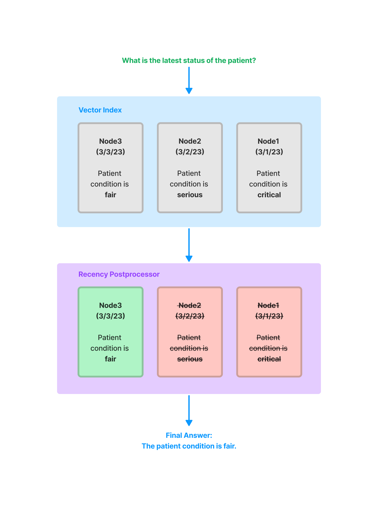
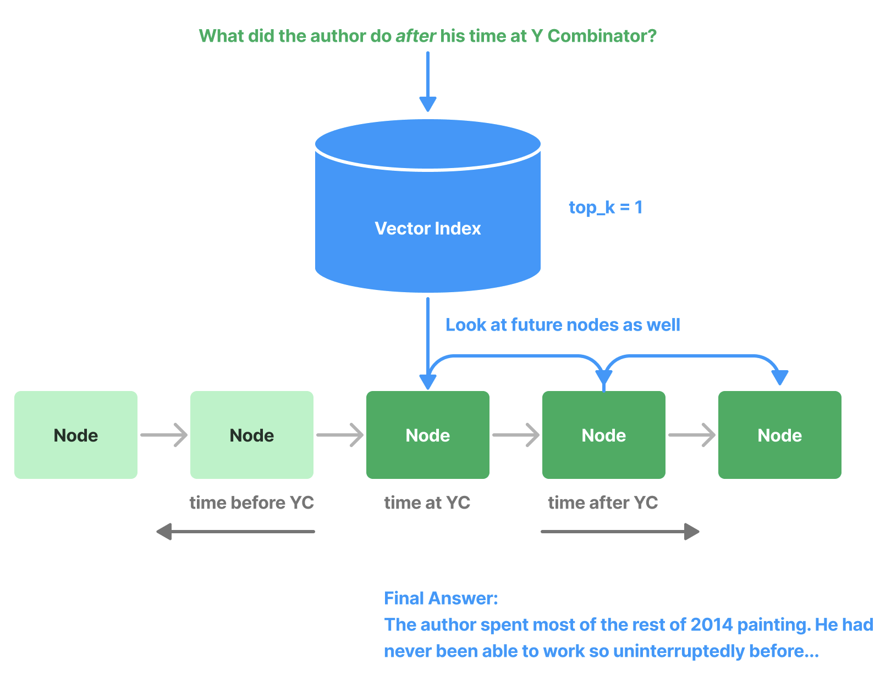

# Node Postprocessor Modules

## SimilarityPostprocessor

Used to remove nodes that are below a similarity score threshold.

```python
from llama_index.core.postprocessor import SimilarityPostprocessor

postprocessor = SimilarityPostprocessor(similarity_cutoff=0.7)

postprocessor.postprocess_nodes(nodes)
```

## KeywordNodePostprocessor

Used to ensure certain keywords are either excluded or included.

```python
from llama_index.core.postprocessor import KeywordNodePostprocessor

postprocessor = KeywordNodePostprocessor(
    required_keywords=["word1", "word2"], exclude_keywords=["word3", "word4"]
)

postprocessor.postprocess_nodes(nodes)
```

## MetadataReplacementPostProcessor

Used to replace the node content with a field from the node metadata. If the field is not present in the metadata, then the node text remains unchanged. Most useful when used in combination with the `SentenceWindowNodeParser`.

```python
from llama_index.core.postprocessor import MetadataReplacementPostProcessor

postprocessor = MetadataReplacementPostProcessor(
    target_metadata_key="window",
)

postprocessor.postprocess_nodes(nodes)
```

## LongContextReorder

Models struggle to access significant details found in the center of extended contexts. [A study](https://arxiv.org/abs/2307.03172) observed that the best performance typically arises when crucial data is positioned at the start or conclusion of the input context. Additionally, as the input context lengthens, performance drops notably, even in models designed for long contexts.

This module will re-order the retrieved nodes, which can be helpful in cases where a large top-k is needed.

```python
from llama_index.core.postprocessor import LongContextReorder

postprocessor = LongContextReorder()

postprocessor.postprocess_nodes(nodes)
```

## SentenceEmbeddingOptimizer

This postprocessor optimizes token usage by removing sentences that are not relevant to the query (this is done using embeddings).

The percentile cutoff is a measure for using the top percentage of relevant sentences.

The threshold cutoff can be specified instead, which uses a raw similarity cutoff for picking which sentences to keep.

```python
from llama_index.core.postprocessor import SentenceEmbeddingOptimizer

postprocessor = SentenceEmbeddingOptimizer(
    embed_model=service_context.embed_model,
    percentile_cutoff=0.5,
    # threshold_cutoff=0.7
)

postprocessor.postprocess_nodes(nodes)
```

A full notebook guide can be found [here](../../../examples/node_postprocessor/OptimizerDemo.ipynb)

## CohereRerank

Uses the "Cohere ReRank" functionality to re-order nodes, and returns the top N nodes.

```python
from llama_index.postprocessor.cohere_rerank import CohereRerank

postprocessor = CohereRerank(
    top_n=2, model="rerank-english-v2.0", api_key="YOUR COHERE API KEY"
)

postprocessor.postprocess_nodes(nodes)
```

Full notebook guide is available [here](../../../examples/node_postprocessor/CohereRerank.ipynb).

## SentenceTransformerRerank

Uses the cross-encoders from the `sentence-transformer` package to re-order nodes, and returns the top N nodes.

```python
from llama_index.core.postprocessor import SentenceTransformerRerank

# We choose a model with relatively high speed and decent accuracy.
postprocessor = SentenceTransformerRerank(
    model="cross-encoder/ms-marco-MiniLM-L-2-v2", top_n=3
)

postprocessor.postprocess_nodes(nodes)
```

Full notebook guide is available [here](../../../examples/node_postprocessor/SentenceTransformerRerank.ipynb).

Please also refer to the [`sentence-transformer` docs](https://www.sbert.net/docs/pretrained-models/ce-msmarco.html) for a more complete list of models (and also shows tradeoffs in speed/accuracy). The default model is `cross-encoder/ms-marco-TinyBERT-L-2-v2`, which provides the most speed.

## LLM Rerank

Uses a LLM to re-order nodes by asking the LLM to return the relevant documents and a score of how relevant they are. Returns the top N ranked nodes.

```python
from llama_index.core.postprocessor import LLMRerank

postprocessor = LLMRerank(top_n=2, service_context=service_context)

postprocessor.postprocess_nodes(nodes)
```

Full notebook guide is available [her for Gatsby](../../../examples/node_postprocessor/LLMReranker-Gatsby.ipynb) and [here for Lyft 10K documents](../../../examples/node_postprocessor/LLMReranker-Lyft-10k.ipynb).

## JinaRerank

Uses the "Jina ReRank" functionality to re-order nodes, and returns the top N nodes.

```python
from llama_index.postprocessor.jinaai_rerank import JinaRerank

postprocessor = JinaRerank(
    top_n=2, model="jina-reranker-v1-base-en", api_key="YOUR JINA API KEY"
)

postprocessor.postprocess_nodes(nodes)
```

Full notebook guide is available [here](../../../examples/node_postprocessor/JinaRerank.ipynb).

## FixedRecencyPostprocessor

This postproccesor returns the top K nodes sorted by date. This assumes there is a `date` field to parse in the metadata of each node.

```python
from llama_index.core.postprocessor import FixedRecencyPostprocessor

postprocessor = FixedRecencyPostprocessor(
    tok_k=1, date_key="date"  # the key in the metadata to find the date
)

postprocessor.postprocess_nodes(nodes)
```



A full notebook guide is available [here](../../..../../../examples/node_postprocessor/RecencyPostprocessorDemo.ipynb).

## EmbeddingRecencyPostprocessor

This postproccesor returns the top K nodes after sorting by date and removing older nodes that are too similar after measuring embedding similarity.

```python
from llama_index.core.postprocessor import EmbeddingRecencyPostprocessor

postprocessor = EmbeddingRecencyPostprocessor(
    service_context=service_context, date_key="date", similarity_cutoff=0.7
)

postprocessor.postprocess_nodes(nodes)
```

A full notebook guide is available [here](../../..../../../examples/node_postprocessor/RecencyPostprocessorDemo.ipynb).

## TimeWeightedPostprocessor

This postproccesor returns the top K nodes applying a time-weighted rerank to each node. Each time a node is retrieved, the time it was retrieved is recorded. This biases search to favor information that has not be returned in a query yet.

```python
from llama_index.core.postprocessor import TimeWeightedPostprocessor

postprocessor = TimeWeightedPostprocessor(time_decay=0.99, top_k=1)

postprocessor.postprocess_nodes(nodes)
```

A full notebook guide is available [here](../../../examples/node_postprocessor/TimeWeightedPostprocessorDemo.ipynb).

## (Beta) PIINodePostprocessor

The PII (Personal Identifiable Information) postprocssor removes information that might be a security risk. It does this by using NER (either with a dedicated NER model, or with a local LLM model).

### LLM Version

```python
from llama_index.core.postprocessor import PIINodePostprocessor

postprocessor = PIINodePostprocessor(
    service_context=service_context  # this should be setup with an LLM you trust
)

postprocessor.postprocess_nodes(nodes)
```

### NER Version

This version uses the default local model from Hugging Face that is loaded when you run `pipeline("ner")`.

```python
from llama_index.core.postprocessor import NERPIINodePostprocessor

postprocessor = NERPIINodePostprocessor()

postprocessor.postprocess_nodes(nodes)
```

A full notebook guide for both can be found [here](../../../examples/node_postprocessor/PII.ipynb).

## (Beta) PrevNextNodePostprocessor

Uses pre-defined settings to read the `Node` relationships and fetch either all nodes that come previously, next, or both.

This is useful when you know the relationships point to important data (either before, after, or both) that should be sent to the LLM if that node is retrieved.

```python
from llama_index.core.postprocessor import PrevNextNodePostprocessor

postprocessor = PrevNextNodePostprocessor(
    docstore=index.docstore,
    num_nodes=1,  # number of nodes to fetch when looking forawrds or backwards
    mode="next",  # can be either 'next', 'previous', or 'both'
)

postprocessor.postprocess_nodes(nodes)
```



## (Beta) AutoPrevNextNodePostprocessor

The same as PrevNextNodePostprocessor, but lets the LLM decide the mode (next, previous, or both).

```python
from llama_index.core.postprocessor import AutoPrevNextNodePostprocessor

postprocessor = AutoPrevNextNodePostprocessor(
    docstore=index.docstore,
    service_context=service_context,
    num_nodes=1,  # number of nodes to fetch when looking forawrds or backwards)
)
postprocessor.postprocess_nodes(nodes)
```

A full example notebook is available [here](../../../examples/node_postprocessor/PrevNextPostprocessorDemo.ipynb).

## (Beta) RankGPT

Uses RankGPT agent to rerank documents according to relevance. Returns the top N ranked nodes.

```python
from llama_index.postprocessor.rankgpt_rerank import RankGPTRerank

postprocessor = RankGPTRerank(top_n=3, llm=OpenAI(model="gpt-3.5-turbo-16k"))

postprocessor.postprocess_nodes(nodes)
```

Full notebook guide is available [here](../../../examples/node_postprocessor/rankGPT.ipynb).

## Colbert Reranker

Uses Colbert V2 model as a reranker to rerank documents according to the fine-grained similarity between query tokens and passage tokens. Returns the top N ranked nodes.

```python
from llama_index.postprocessor.colbert_rerank import ColbertRerank

colbert_reranker = ColbertRerank(
    top_n=5,
    model="colbert-ir/colbertv2.0",
    tokenizer="colbert-ir/colbertv2.0",
    keep_retrieval_score=True,
)

query_engine = index.as_query_engine(
    similarity_top_k=10,
    node_postprocessors=[colbert_reranker],
)
response = query_engine.query(
    query_str,
)
```

Full notebook guide is available [here](../../../examples/node_postprocessor/ColbertRerank.ipynb).

## rankLLM

Uses models from [rankLLM](https://github.com/castorini/rank_llm) to rerank documents. Returns the top N ranked nodes.

```python
from llama_index.postprocessor.rankllm_rerank import RankLLMRerank

# RankZephyr reranker, return top 5 candidates
reranker = RankLLMRerank(model="rank_zephyr", top_n=5)
reranker.postprocess_nodes(nodes)
```

A full [notebook example is available](../../../examples/node_postprocessor/rankLLM.ipynb).

## All Notebooks

- [Sentence Optimizer](../../../examples/node_postprocessor/OptimizerDemo.ipynb)
- [Cohere Rerank](../../../examples/node_postprocessor/CohereRerank.ipynb)
- [LLM Reranker Lyft 10k](../../../examples/node_postprocessor/LLMReranker-Lyft-10k.ipynb)
- [LLM Reranker Gatsby](../../../examples/node_postprocessor/LLMReranker-Gatsby.ipynb)
- [Recency](../../../examples/node_postprocessor/RecencyPostprocessorDemo.ipynb)
- [Time Weighted](../../../examples/node_postprocessor/TimeWeightedPostprocessorDemo.ipynb)
- [PII](../../../examples/node_postprocessor/PII.ipynb)
- [PrevNext](../../../examples/node_postprocessor/PrevNextPostprocessorDemo.ipynb)
- [Metadata Replacement](../../../examples/node_postprocessor/MetadataReplacementDemo.ipynb)
- [Long Context Reorder](../../../examples/node_postprocessor/LongContextReorder.ipynb)
- [RankGPT](../../../examples/node_postprocessor/rankGPT.ipynb)
- [Colbert Rerank](../../../examples/node_postprocessor/ColbertRerank.ipynb)
- [JinaAI Rerank](../../../examples/node_postprocessor/JinaRerank.ipynb)
- [MixedBread Rerank](../../../examples/cookbooks/mixedbread_reranker.ipynb)
- [RankLLM](../../../examples/node_postprocessor/rankLLM.ipynb)
