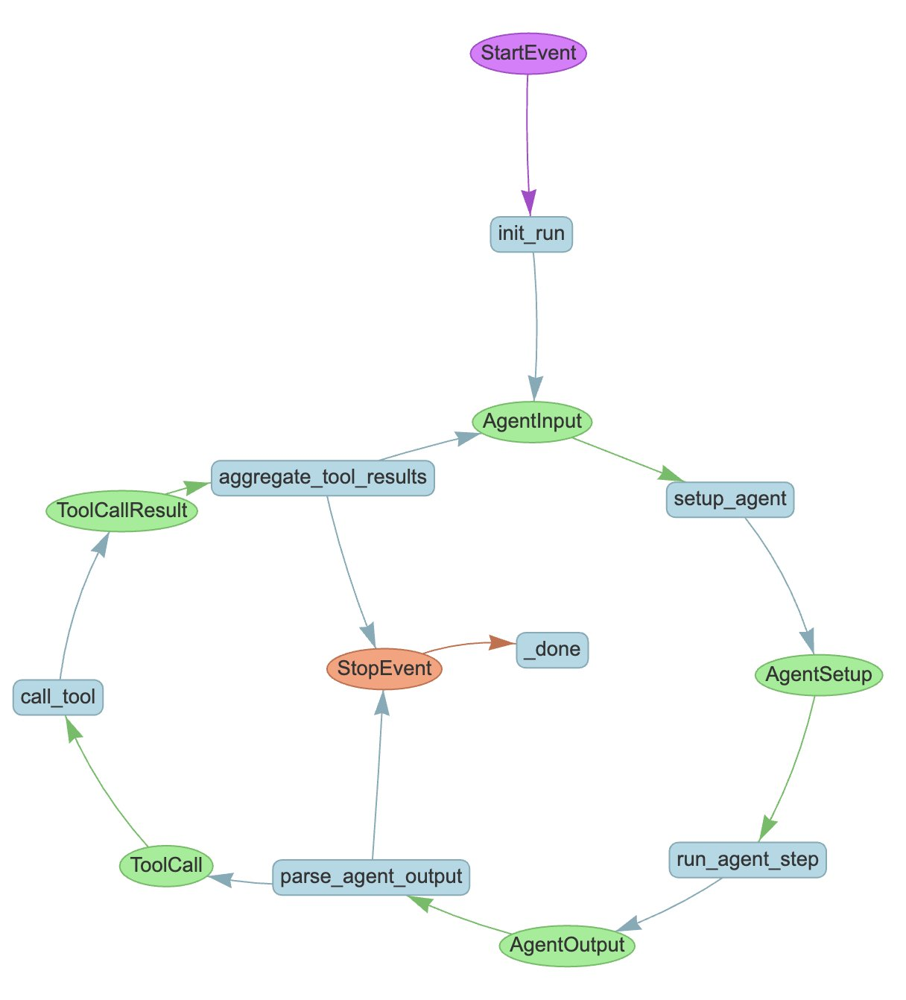

# Human in the loop

Tools can also be defined that get a human in the loop. This is useful for tasks that require human input, such as confirming a tool call or providing feedback.

As we'll see in our [Workflows tutorial](../workflows/index.md), the way Workflows work under the hood of AgentWorkflow is by running steps which both emit and receive events. Here's a diagram of the steps (in blue) that make up an AgentWorkflow and the events (in green) that pass data between them. You'll recognize these events, they're the same ones we were handling in the output stream earlier.



To get a human in the loop, we'll get our tool to emit an event that isn't received by any other step in the workflow. We'll then tell our tool to wait until it receives a specific "reply" event.

We have built-in `InputRequiredEvent` and `HumanResponseEvent` events to use for this purpose. If you want to capture different forms of human input, you can subclass these events to match your own preferences. Let's import them:

```python
from llama_index.core.workflow import (
    InputRequiredEvent,
    HumanResponseEvent,
)
```

Next we'll create a tool that performs a hypothetical dangerous task. There are a couple of new things happening here:

* `wait_for_event` is used to wait for a HumanResponseEvent.
* The `waiter_event` is the event that is written to the event stream, to let the caller know that we're waiting for a response.
* `waiter_id` is a unique identifier for this specific wait call. It helps ensure that we only send one `waiter_event` for each `waiter_id`.
* The `requirements` argument is used to specify that we want to wait for a HumanResponseEvent with a specific `user_name`.

```python
from llama_index.core.workflow import Context


async def dangerous_task(ctx: Context) -> str:
    """A dangerous task that requires human confirmation."""

    # emit a waiter event (InputRequiredEvent here)
    # and wait until we see a HumanResponseEvent
    question = "Are you sure you want to proceed? "
    response = await ctx.wait_for_event(
        HumanResponseEvent,
        waiter_id=question,
        waiter_event=InputRequiredEvent(
            prefix=question,
            user_name="Laurie",
        ),
        requirements={"user_name": "Laurie"},
    )

    # act on the input from the event
    if response.response.strip().lower() == "yes":
        return "Dangerous task completed successfully."
    else:
        return "Dangerous task aborted."
```

We create our agent as usual, passing it the tool we just defined:

```python
workflow = FunctionAgent(
    tools=[dangerous_task],
    llm=llm,
    system_prompt="You are a helpful assistant that can perform dangerous tasks.",
)
```

Now we can run the workflow, handling the `InputRequiredEvent` just like any other streaming event, and responding with a `HumanResponseEvent` passed in using the `send_event` method:

```python
handler = workflow.run(user_msg="I want to proceed with the dangerous task.")

async for event in handler.stream_events():
    if isinstance(event, InputRequiredEvent):
        # capture keyboard input
        response = input(event.prefix)
        # send our response back
        handler.ctx.send_event(
            HumanResponseEvent(
                response=response,
                user_name=event.user_name,
            )
        )

response = await handler
print(str(response))
```

As usual, you can see the [full code of this example](https://github.com/run-llama/python-agents-tutorial/blob/main/5_human_in_the_loop.py).

You can do anything you want to capture the input; you could use a GUI, or audio input, or even get another, separate agent involved. If your input is going to take a while, or happen in another process, you might want to [serialize the context](./state.md) and save it to a database or file so that you can resume the workflow later.

Speaking of getting other agents involved brings us to our next section, [multi-agent systems](./multi_agent.md).
