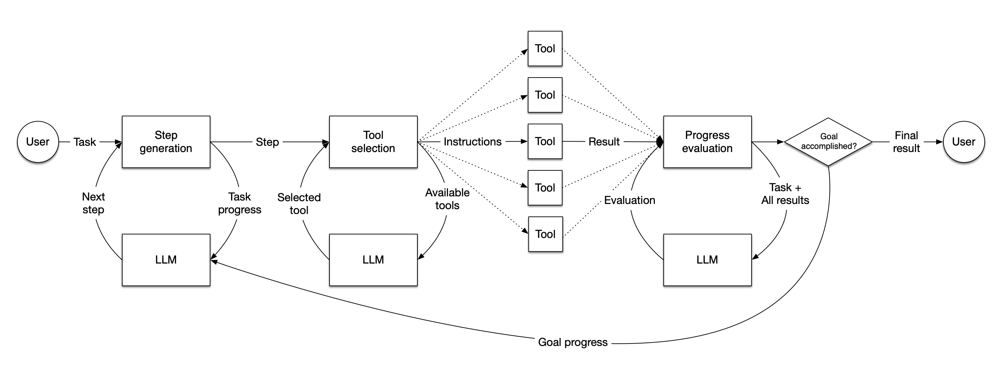

# Building an agent

In LlamaIndex, an agent is a semi-autonomous piece of software powered by an LLM that is given a task and executes a series of steps towards solving that task. It is given a set of tools, which can be anything from arbitrary functions up to full LlamaIndex query engines, and it selects the best available tool to complete each step. When each step is completed, the agent judges whether the task is now complete, in which case it returns a result to the user, or whether it needs to take another step, in which case it loops back to the start.

In LlamaIndex, you can either [build your own agentic workflows from scratch](../workflows/index.md), covered in the "Building Workflows" section, or you can use our pre-built agentic workflows like `FunctionAgent` (a simple function/tool calling agent) or `AgentWorkflow` (an agent capable of managing multiple agents). This tutorial covers building a function calling agent using `FunctionAgent`.

To learn about how to build a multi-agent system, go to ["Multi-agent systems with AgentWorkflow"](./multi_agent.md).



## Getting started

You can find all of this code in [the agents tutorial repo](https://github.com/run-llama/python-agents-tutorial).

To avoid conflicts and keep things clean, we'll start a new Python virtual environment. You can use any virtual environment manager, but we'll use `poetry` here:

```bash
poetry init
poetry shell
```

And then we'll install the LlamaIndex library and some other dependencies that will come in handy:

```bash
pip install llama-index-core llama-index-llms-openai python-dotenv
```

If any of this gives you trouble, check out our more detailed [installation guide](../../getting_started/installation.md).

## OpenAI Key

Our agent will be powered by OpenAI's `gpt-4o-mini` LLM, so you'll need an [API key](https://platform.openai.com/). Once you have your key, you can put it in a `.env` file in the root of your project:

```bash
OPENAI_API_KEY=sk-proj-xxxx
```

If you don't want to use OpenAI, you can use [any other LLM](../using_llms/using_llms.md) including local models. Agents require capable models, so smaller models may be less reliable.

## Bring in dependencies

We'll start by importing the components of LlamaIndex we need, as well as loading the environment variables from our `.env` file:

```python
from dotenv import load_dotenv

load_dotenv()

from llama_index.llms.openai import OpenAI
from llama_index.core.agent.workflow import FunctionAgent
```

## Create basic tools

For this simple example we'll be creating two tools: one that knows how to multiply numbers together, and one that knows how to add them.

```python
def multiply(a: float, b: float) -> float:
    """Multiply two numbers and returns the product"""
    return a * b


def add(a: float, b: float) -> float:
    """Add two numbers and returns the sum"""
    return a + b
```

As you can see, these are regular Python functions. When deciding what tool to use, your agent will use the tool's name, parameters, and docstring to determine what the tool does and whether it's appropriate for the task at hand. So it's important to make sure the docstrings are descriptive and helpful. It will also use the type hints to determine the expected parameters and return type.

## Initialize the LLM

`gpt-4o-mini` is going to be doing the work today:

```python
llm = OpenAI(model="gpt-4o-mini")
```

You could also pick another popular model accessible via API, such as those from [Mistral](../../examples/llm/mistralai.ipynb), [Claude from Anthropic](../../examples/llm/anthropic.ipynb) or [Gemini from Google](../../examples/llm/google_genai.ipynb).

## Initialize the agent

Now we create our agent. It needs an array of tools, an LLM, and a system prompt to tell it what kind of agent to be. Your system prompt would usually be more detailed than this!

```python
workflow = FunctionAgent(
    tools=[multiply, add],
    llm=llm,
    system_prompt="You are an agent that can perform basic mathematical operations using tools.",
)
```

GPT-4o-mini is actually smart enough to not need tools to do such simple math, which is why we specified that it should use tools in the prompt.

## Ask a question

Now we can ask the agent to do some math:

```python
response = await workflow.run(user_msg="What is 20+(2*4)?")
print(response)
```

Note that this is asynchronous code. It will work in a notebook environment, but if you want to run it in regular Python you'll need to wrap it an asynchronous function, like this:

```python
async def main():
    response = await workflow.run(user_msg="What is 20+(2*4)?")
    print(response)


if __name__ == "__main__":
    import asyncio

    asyncio.run(main())
```

This should give you output similar to the following:

```
The result of (20 + (2 times 4)) is 28.
```

Check the [repo](https://github.com/run-llama/python-agents-tutorial/blob/main/1_basic_agent.py) to see what the final code should look like.

Congratulations! You've built the most basic kind of agent. Next let's learn how to use [pre-built tools](./tools.md).
