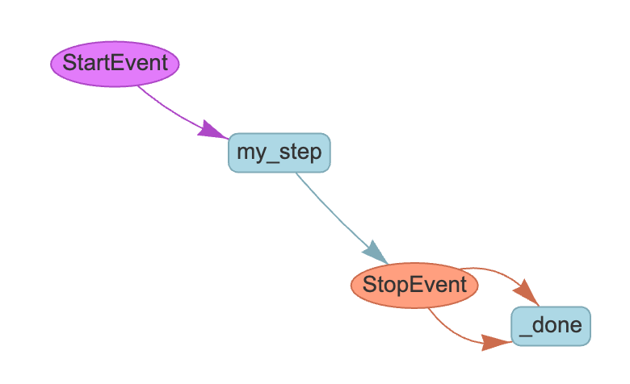
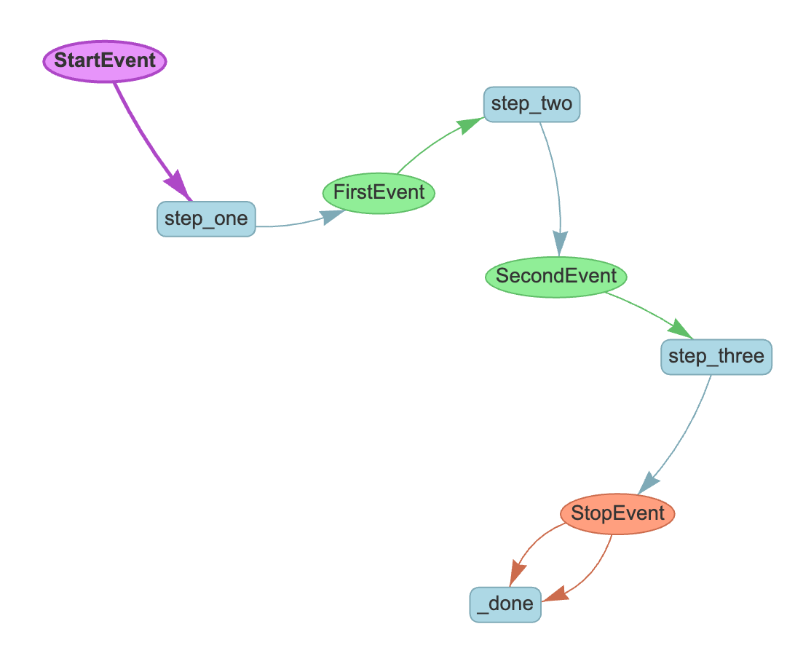

# Basic workflow

## Getting started

Workflows are built into LlamaIndex core, so to use them all you need is

```
pip install llama-index-core
```

During development you will probably find it helpful to visualize your workflow; you can use our built-in visualizer for this by installing it:

```
pip install llama-index-utils-workflow
```

## Dependencies

The minimal dependencies for a workflow are:

```python
from llama_index.core.workflow import (
    StartEvent,
    StopEvent,
    Workflow,
    step,
)
```

## Single-step workflow

A workflow is usually implemented as a class that inherits from `Workflow`. The class can define an arbitrary number of steps, each of which is a method decorated with `@step`. Here is the simplest possible workflow:

```python
class MyWorkflow(Workflow):
    @step
    async def my_step(self, ev: StartEvent) -> StopEvent:
        # do something here
        return StopEvent(result="Hello, world!")


w = MyWorkflow(timeout=10, verbose=False)
result = await w.run()
print(result)
```

This will simply print "Hello, World!" to the console.

In this code we:

* Define a class `MyWorkflow` that inherits from `Workflow`
* Use the @step decorator to define a single step `my_step`
* The step takes a single argument, `ev`, which is an instance of `StartEvent`
* The step returns a `StopEvent` with a result of "Hello, world!"
* We create an instance of `MyWorkflow` with a timeout of 10 seconds and verbosity off
* We run the workflow and print the result

## Type annotations for steps

The type annotations (e.g. `ev: StartEvent`) and `-> StopEvent` are essential to the way Workflows work. The expected types determine what event types will trigger a step. Tools like the visualizer (see below) also rely on these annotations to determine what types are generated and therefore where control flow goes next.

Type annotations are validated at compile time, so you will get an error message if for instance you emit an event that is never consumed by another step.

## Start and Stop events

`StartEvent` and `StopEvent` are special events that are used to start and stop a workflow. Any step that accepts a `StartEvent` will be triggered by the `run` command. Emitting a `StopEvent` will end the execution of the workflow and return a final result, even if other steps remain un-executed.

## Running a workflow in regular python

Workflows are async by default, so you use `await` to get the result of the `run` command. This will work fine in a notebook environment; in a vanilla python script you will need to import `asyncio` and wrap your code in an async function, like this:

```python
async def main():
    w = MyWorkflow(timeout=10, verbose=False)
    result = await w.run()
    print(result)


if __name__ == "__main__":
    import asyncio

    asyncio.run(main())
```

In the remaining examples in this tutorial we will assume an async environment for simplicity.

## Visualizing a workflow

A great feature of workflows is the built-in visualizer, which we already installed. Let's visualize the simple workflow we just created:

```python
from llama_index.utils.workflow import draw_all_possible_flows

draw_all_possible_flows(MyWorkflow, filename="basic_workflow.html")
```

This will create a file called `basic_workflow.html` in the current directory. Open it in your browser to see an interactive, visual representation of the workflow. It will look something like this:



Of course, a flow with a single step is not very useful! Let's define a multi-step workflow.

## Custom Events

Multiple steps are created by defining custom events that can be emitted by steps and trigger other steps. Let's define a simple 3-step workflow.

We bring in our imports as before, plus a new import for `Event`:

```python
from llama_index.core.workflow import (
    StartEvent,
    StopEvent,
    Workflow,
    step,
    Event,
)
from llama_index.utils.workflow import draw_all_possible_flows
```

Now we define two custom events, `FirstEvent` and `SecondEvent`. These classes can have any names and properties, but must inherit from `Event`:

```python
class FirstEvent(Event):
    first_output: str


class SecondEvent(Event):
    second_output: str
```

## Defining the workflow

Now we define the workflow itself. We do this by defining the input and output types on each step.

* `step_one` takes a `StartEvent` and returns a `FirstEvent`
* `step_two` takes a `FirstEvent` and returns a `SecondEvent`
* `step_three` takes a `SecondEvent` and returns a `StopEvent`

```python
class MyWorkflow(Workflow):
    @step
    async def step_one(self, ev: StartEvent) -> FirstEvent:
        print(ev.first_input)
        return FirstEvent(first_output="First step complete.")

    @step
    async def step_two(self, ev: FirstEvent) -> SecondEvent:
        print(ev.first_output)
        return SecondEvent(second_output="Second step complete.")

    @step
    async def step_three(self, ev: SecondEvent) -> StopEvent:
        print(ev.second_output)
        return StopEvent(result="Workflow complete.")


w = MyWorkflow(timeout=10, verbose=False)
result = await w.run(first_input="Start the workflow.")
print(result)
```

The full output will be

```
Start the workflow.
First step complete.
Second step complete.
Workflow complete.
```

And we can use our visualizer to see all possible flows through this workflow:

```python
from llama_index.utils.workflow import draw_all_possible_flows

draw_all_possible_flows(MyWorkflow, filename="multi_step_workflow.html")
```



Of course there is still not much point to a workflow if you just run through it from beginning to end! Let's do some [branching and looping](branches_and_loops.md).
