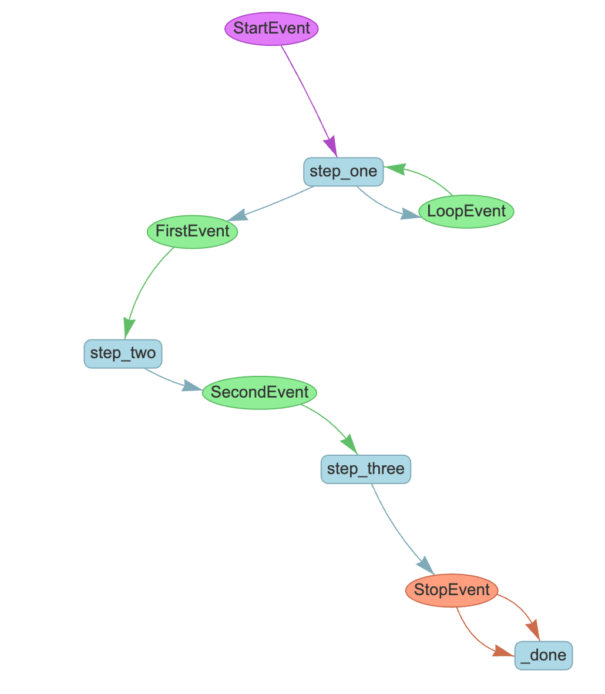
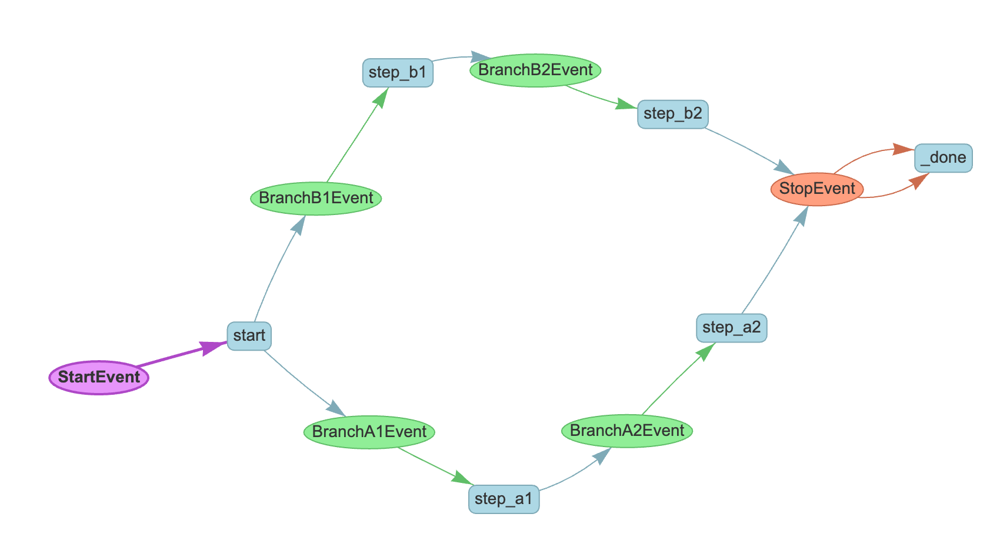

# Branches and loops

A key feature of Workflows is their enablement of branching and looping logic, more simply and flexibly than graph-based approaches.

## Loops in workflows

To create a loop, we'll take our example `MyWorkflow` from the previous tutorial and add one new custom event type. We'll call it `LoopEvent` but again it can have any arbitrary name.

```python
class LoopEvent(Event):
    loop_output: str
```

Now we'll `import random` and modify our `step_one` function to randomly decide either to loop or to continue:

```python
@step
async def step_one(self, ev: StartEvent | LoopEvent) -> FirstEvent | LoopEvent:
    if random.randint(0, 1) == 0:
        print("Bad thing happened")
        return LoopEvent(loop_output="Back to step one.")
    else:
        print("Good thing happened")
        return FirstEvent(first_output="First step complete.")
```

Let's visualize this:



You can create a loop from any step to any other step by defining the appropriate event types and return types.

## Branches in workflows

Closely related to looping is branching. As you've already seen, you can conditionally return different events. Let's see a workflow that branches into two different paths:

```python
class BranchA1Event(Event):
    payload: str


class BranchA2Event(Event):
    payload: str


class BranchB1Event(Event):
    payload: str


class BranchB2Event(Event):
    payload: str


class BranchWorkflow(Workflow):
    @step
    async def start(self, ev: StartEvent) -> BranchA1Event | BranchB1Event:
        if random.randint(0, 1) == 0:
            print("Go to branch A")
            return BranchA1Event(payload="Branch A")
        else:
            print("Go to branch B")
            return BranchB1Event(payload="Branch B")

    @step
    async def step_a1(self, ev: BranchA1Event) -> BranchA2Event:
        print(ev.payload)
        return BranchA2Event(payload=ev.payload)

    @step
    async def step_b1(self, ev: BranchB1Event) -> BranchB2Event:
        print(ev.payload)
        return BranchB2Event(payload=ev.payload)

    @step
    async def step_a2(self, ev: BranchA2Event) -> StopEvent:
        print(ev.payload)
        return StopEvent(result="Branch A complete.")

    @step
    async def step_b2(self, ev: BranchB2Event) -> StopEvent:
        print(ev.payload)
        return StopEvent(result="Branch B complete.")
```

Our imports are the same as before, but we've created 4 new event types. `start` randomly decides to take one branch or another, and then multiple steps in each branch complete the workflow. Let's visualize this:



You can of course combine branches and loops in any order to fulfill the needs of your application. Later in this tutorial you'll learn how to run multiple branches in parallel using `send_event` and synchronize them using `collect_events`.

Up next we'll learn about [maintaining state](state.md) with Context.
