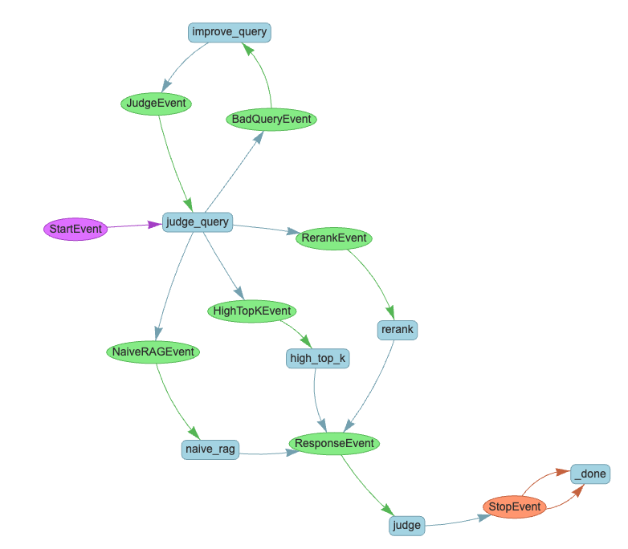

# Workflows introduction

## What is a workflow?

A workflow is an event-driven, step-based way to control the execution flow of an application.

Your application is divided into sections called Steps which are triggered by Events, and themselves emit Events which trigger further steps. By combining steps and events, you can create arbitrarily complex flows that encapsulate logic and make your application more maintainable and easier to understand. A step can be anything from a single line of code to a complex agent. They can have arbitrary inputs and outputs, which are passed around by Events.

## An example

In this visualization, you can see a moderately complex workflow designed to take a query, optionally improve upon it, and then attempt to answer the query using three different RAG strategies. The LLM gets answers from all three strategies and judges which is the "best", and returns that. We can break this flow down:

* It is triggered by a `StartEvent`
* A step called `judge_query` determines if the query is of high quality. If not, a `BadQueryEvent` is generated.
* A `BadQueryEvent` will trigger a step called `improve_query` which will attempt to improve the query, which will then trigger a `JudgeEvent`
* A `JudgeEvent` will trigger `judge_query` again, creating a loop which can continue until the query is judged of sufficient quality. This is called "Reflection" and is a key part of agentic applications that Workflows make easy to implement.
* If the query is of sufficient quality, 3 simultaneous events are generated: a `NaiveRAGEvent`, a `HighTopKEvent`, and a `RerankEvent`. These three events trigger 3 associated steps in parallel, which each run a different RAG strategy.
* Each of the query steps generates a `ResponseEvent`. A `ResponseEvent` triggers a step called `judge_response` which will wait until it has received all 3 responses.
* `judge_response` will then pick the "best" response and return it to the user via a `StopEvent`.

## Why workflows?

As generative AI applications become more complex, it becomes harder to manage the flow of data and control the execution of the application. Workflows provide a way to manage this complexity by breaking the application into smaller, more manageable pieces.

Other frameworks and LlamaIndex itself have attempted to solve this problem previously with directed acyclic graphs (DAGs) but these have a number of limitations that workflows do not:

* Logic like loops and branches needed to be encoded into the edges of graphs, which made them hard to read and understand.
* Passing data between nodes in a DAG created complexity around optional and default values and which parameters should be passed.
* DAGs did not feel natural to developers trying to developing complex, looping, branching AI applications.

The event-based pattern and vanilla python approach of Workflows resolves these problems.

For simple RAG pipelines and linear demos we do not expect you will need Workflows, but as your application grows in complexity, we hope you will reach for them.

## Next steps

Let's build [a basic workflow](basic_flow.md). Follow the tutorial sequence step-by-step to learn the core concepts.

Once you're done, check out our [Workflows component guide](../../module_guides/workflow/index.md) as a reference guide + more practical examples on building RAG/agents.

If you're done building and want to deploy your workflow to production, check out [our llama_deploy guide](../../module_guides/workflow/deployment.md) ([repo](https://github.com/run-llama/llama_deploy)).
