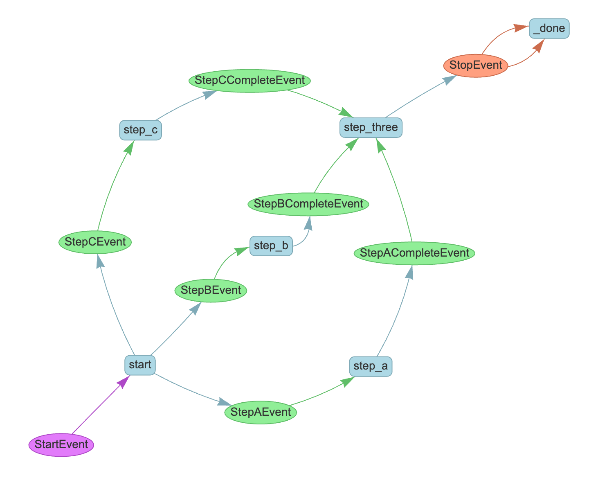
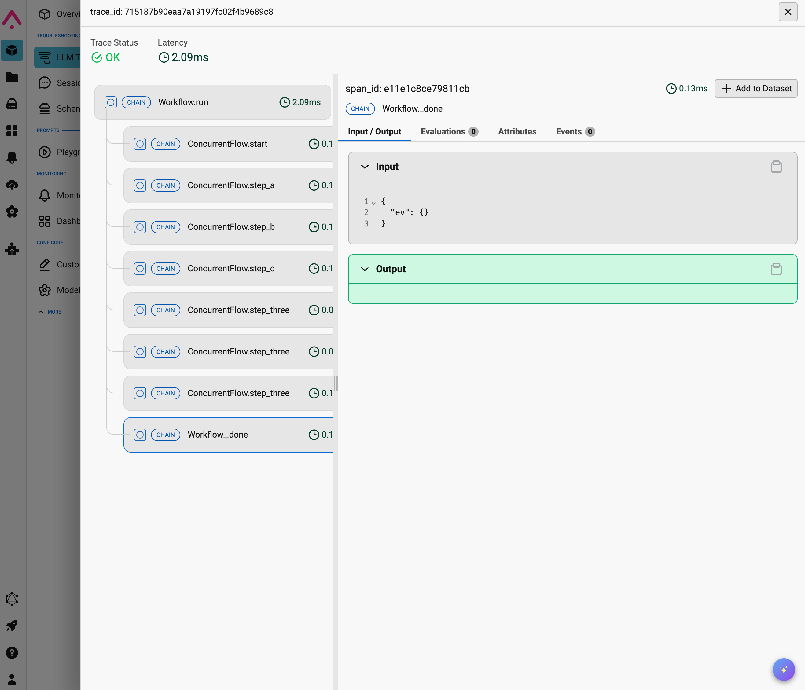

# Observability

Debugging is essential to any application development, and Workflows provide you a number of ways to do that.

## Visualization

The simplest form of debugging is visualization, which we've already used extensively in this tutorial. You can visualize your workflow at any time by running the following code:

```python
from llama_index.utils.workflow import draw_all_possible_flows

draw_all_possible_flows(MyWorkflow, filename="some_filename.html")
```

This will output an interactive visualization of your flow to `some_filename.html` that you can view in any browser.



## Verbose mode

When running any workflow you can always pass `verbose=True`. This will output the name of each step as it's executed, and whether and which type of event it returns. Using the `ConcurrentWorkflow` from the previous stage of this tutorial:

```python
class ConcurrentFlow(Workflow):
    @step
    async def start(
        self, ctx: Context, ev: StartEvent
    ) -> StepAEvent | StepBEvent | StepCEvent:
        ctx.send_event(StepAEvent(query="Query 1"))
        ctx.send_event(StepBEvent(query="Query 2"))
        ctx.send_event(StepCEvent(query="Query 3"))

    @step
    async def step_a(self, ctx: Context, ev: StepAEvent) -> StepACompleteEvent:
        print("Doing something A-ish")
        return StepACompleteEvent(result=ev.query)

    @step
    async def step_b(self, ctx: Context, ev: StepBEvent) -> StepBCompleteEvent:
        print("Doing something B-ish")
        return StepBCompleteEvent(result=ev.query)

    @step
    async def step_c(self, ctx: Context, ev: StepCEvent) -> StepCCompleteEvent:
        print("Doing something C-ish")
        return StepCCompleteEvent(result=ev.query)

    @step
    async def step_three(
        self,
        ctx: Context,
        ev: StepACompleteEvent | StepBCompleteEvent | StepCCompleteEvent,
    ) -> StopEvent:
        print("Received event ", ev.result)

        # wait until we receive 3 events
        if (
            ctx.collect_events(
                ev,
                [StepCCompleteEvent, StepACompleteEvent, StepBCompleteEvent],
            )
            is None
        ):
            return None

        # do something with all 3 results together
        return StopEvent(result="Done")
```

You can run the workflow with verbose mode like this:

```python
w = ConcurrentFlow(timeout=10, verbose=True)
result = await w.run()
```

And you'll see output like this:

```
Running step start
Step start produced no event
Running step step_a
Doing something A-ish
Step step_a produced event StepACompleteEvent
Running step step_b
Doing something B-ish
Step step_b produced event StepBCompleteEvent
Running step step_c
Doing something C-ish
Step step_c produced event StepCCompleteEvent
Running step step_three
Received event  Query 1
Step step_three produced no event
Running step step_three
Received event  Query 2
Step step_three produced no event
Running step step_three
Received event  Query 3
Step step_three produced event StopEvent
```

## Stepwise execution

In a notebook environment it can be helpful to run a workflow step by step. You can do this by calling `run_step` on the handler object:

```python
w = ConcurrentFlow(timeout=10, verbose=True)
handler = w.run()

async for _ in handler.run_step():
    # inspect context
    # val = await handler.ctx.get("key")
    continue

# get the result
result = await handler
```

You can call `run_step` multiple times to step through the workflow one step at a time.

## Visualizing most recent execution

If you're running a workflow step by step, or you have just executed a workflow with branching, you can get the visualizer to draw only exactly which steps just executed using `draw_most_recent_execution`:

```python
from llama_index.utils.workflow import draw_most_recent_execution

draw_most_recent_execution(w, filename="last_execution.html")
```

Note that instead of passing the class name you are passing the instance of the workflow, `w`.

## Third party tools

You can also use any of the third-party tools for visualizing and debugging that we support, such as [Arize](https://docs.arize.com/arize/large-language-models/tracing/auto-instrumentation/llamaindex).



## One more thing

Our last step in this tutorial is an alternative syntax for defining workflows using [unbound functions](unbound_functions.md) instead of classes.
