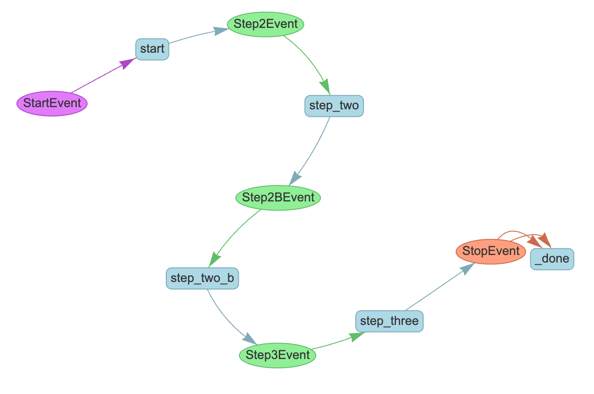

# Subclassing workflows

Another great feature of workflows is their extensibility. You can take workflows written by others or built-ins from LlamaIndex and extend them to customize them to your needs. We'll look at two ways to do that.

The first is subclassing: workflows are just regular Python classes, which means you can subclass them to add new functionality. For example, let's say you have an agentic workflow that does some processing and then sends an email. You can subclass the workflow to add an extra step to send a text message as well.

Here's our base workflow:

```python
from llama_index.core.workflow import (
    StartEvent,
    StopEvent,
    Workflow,
    step,
    Event,
    Context,
)


class Step2Event(Event):
    query: str


class Step3Event(Event):
    query: str


class MainWorkflow(Workflow):
    @step
    async def start(self, ev: StartEvent) -> Step2Event:
        print("Starting up")
        return Step2Event(query=ev.query)

    @step
    async def step_two(self, ev: Step2Event) -> Step3Event:
        print("Sending an email")
        return Step3Event(query=ev.query)

    @step
    async def step_three(self, ev: Step3Event) -> StopEvent:
        print("Finishing up")
        return StopEvent(result=ev.query)
```

If we run this:

```python
w = MainWorkflow(timeout=10, verbose=False)
result = await w.run(query="Initial query")
print(result)
```

We get:

```
Starting up
Sending an email
Finishing up
Initial query
```

Now let's subclass this workflow to send a text message as well:

```python
class Step2BEvent(Event):
    query: str


class CustomWorkflow(MainWorkflow):
    @step
    async def step_two(self, ev: Step2Event) -> Step2BEvent:
        print("Sending an email")
        return Step2BEvent(query=ev.query)

    @step
    async def step_two_b(self, ev: Step2BEvent) -> Step3Event:
        print("Also sending a text message")
        return Step3Event(query=ev.query)
```

Which will instead give us

```
Starting up
Sending an email
Also sending a text message
Finishing up
Initial query
```

We can visualize the subclassed workflow and it will show all the steps, like this:

```python
draw_all_possible_flows(CustomWorkflow, "custom_workflow.html")
```



Next, let's look at another way to extend a workflow: [resources](resources.md).
