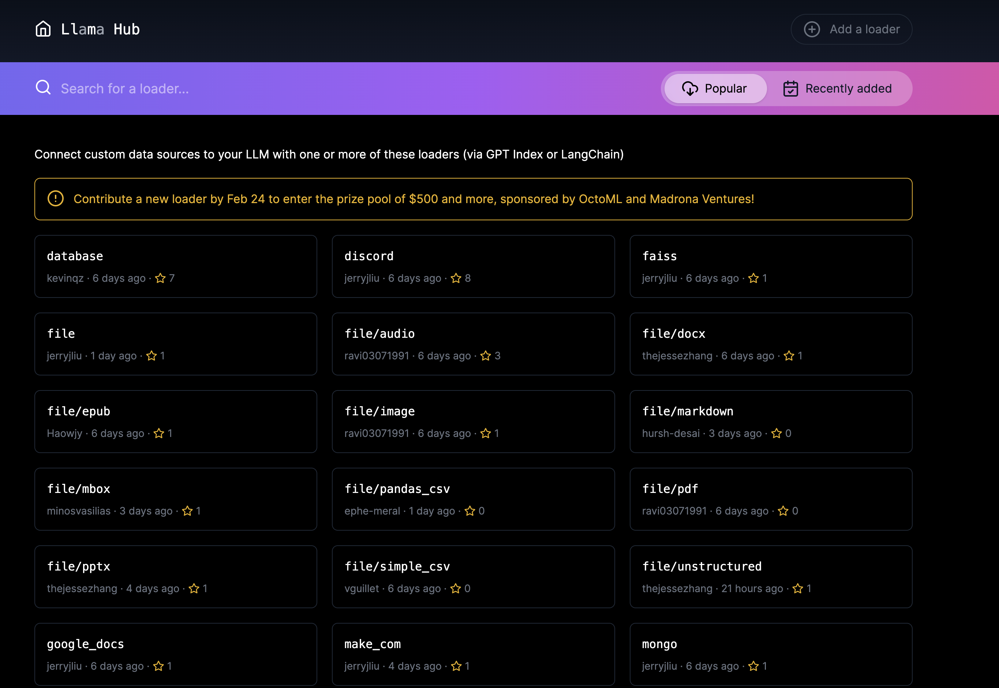

## Concept

A data connector (aka `Reader`) ingest data from different data sources and data formats into a simple `Document` representation (text and simple metadata).

<Aside type="tip">
  Once you've ingested your data, you can build an
  [Index](/python/framework/module_guides/indexing) on top, ask questions using
  a [Query Engine](/python/framework/module_guides/deploying/query_engine), and
  have a conversation using a [Chat
  Engine](/python/framework/module_guides/deploying/chat_engines).
</Aside>

## LlamaHub

Our data connectors are offered through [LlamaHub](https://llamahub.ai/) 🦙.
LlamaHub is an open-source repository containing data loaders that you can easily plug and play into any LlamaIndex application.



## Usage Pattern

Get started with:

```python
from llama_index.core import download_loader

from llama_index.readers.google import GoogleDocsReader

loader = GoogleDocsReader()
documents = loader.load_data(document_ids=[...])
```

See the full [usage pattern guide](/python/framework/module_guides/loading/connector/usage_pattern) for more details.

## Modules

Some sample data connectors:

- local file directory (`SimpleDirectoryReader`). Can support parsing a wide range of file types: `.pdf`, `.jpg`, `.png`, `.docx`, etc.
- [Notion](https://developers.notion.com/) (`NotionPageReader`)
- [Google Docs](https://developers.google.com/docs/api) (`GoogleDocsReader`)
- [Slack](https://api.slack.com/) (`SlackReader`)
- [Discord](https://discord.com/developers/docs/intro) (`DiscordReader`)
- [Apify Actors](https://llamahub.ai/l/readers/llama-index-readers-apify) (`ApifyActor`). Can crawl the web, scrape webpages, extract text content, download files including `.pdf`, `.jpg`, `.png`, `.docx`, etc.

See the [modules guide](/python/framework/module_guides/loading/connector/modules) for more details.
