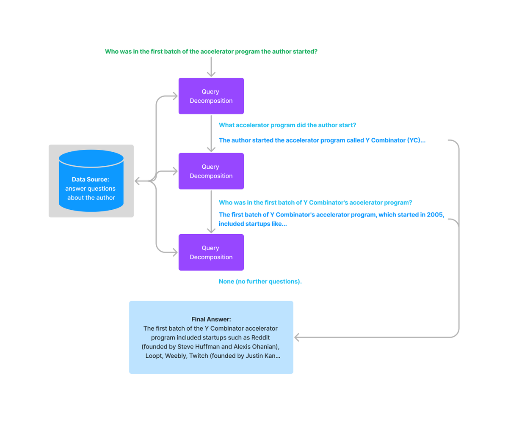

LlamaIndex allows you to perform _query transformations_ over your index structures.
Query transformations are modules that will convert a query into another query. They can be **single-step**, as in the transformation is run once before the query is executed against an index.

They can also be **multi-step**, as in:

1. The query is transformed, executed against an index,
2. The response is retrieved.
3. Subsequent queries are transformed/executed in a sequential fashion.

We list some of our query transformations in more detail below.

#### Use Cases

Query transformations have multiple use cases:

- Transforming an initial query into a form that can be more easily embedded (e.g. HyDE)
- Transforming an initial query into a subquestion that can be more easily answered from the data (single-step query decomposition)
- Breaking an initial query into multiple subquestions that can be more easily answered on their own. (multi-step query decomposition)

### HyDE (Hypothetical Document Embeddings)

[HyDE](http://boston.lti.cs.cmu.edu/luyug/HyDE/HyDE.pdf) is a technique where given a natural language query, a hypothetical document/answer is generated first. This hypothetical document is then used for embedding lookup rather than the raw query.

To use HyDE, an example code snippet is shown below.

```python
from llama_index.core import VectorStoreIndex, SimpleDirectoryReader
from llama_index.core.indices.query.query_transform.base import (
    HyDEQueryTransform,
)
from llama_index.core.query_engine import TransformQueryEngine

# load documents, build index
documents = SimpleDirectoryReader("../paul_graham_essay/data").load_data()
index = VectorStoreIndex(documents)

# run query with HyDE query transform
query_str = "what did paul graham do after going to RISD"
hyde = HyDEQueryTransform(include_original=True)
query_engine = index.as_query_engine()
query_engine = TransformQueryEngine(query_engine, query_transform=hyde)
response = query_engine.query(query_str)
print(response)
```

Check out our [example notebook](https://github.com/jerryjliu/llama_index/blob/main/docs/examples/query_transformations/HyDEQueryTransformDemo.ipynb) for a full walkthrough.

### Step-Back Query Transformation

[Step-back prompting](https://arxiv.org/abs/2310.06117) (Zheng et al., 2023) asks the LLM to
abstract a specific question into a higher-level, principle-oriented question before
retrieval. Retrieving against the abstracted question surfaces documents that explain the
underlying concept, which often improves recall for queries that contain specific
identifiers, dates, or narrow entities.

Unlike HyDE — which keeps the original `query_str` and adds a _hypothetical
document_ to `custom_embedding_strs` — Step-Back _replaces_ `query_str` with the
abstracted question and sets `custom_embedding_strs=[new_query_str]`. This mirrors
the return shape of `DecomposeQueryTransform`.

```python
from llama_index.core import VectorStoreIndex, SimpleDirectoryReader
from llama_index.core.indices.query.query_transform.base import (
    StepBackQueryTransform,
)
from llama_index.core.query_engine import TransformQueryEngine

documents = SimpleDirectoryReader("../paul_graham_essay/data").load_data()
index = VectorStoreIndex(documents)

step_back = StepBackQueryTransform()
query_engine = index.as_query_engine()
query_engine = TransformQueryEngine(query_engine, query_transform=step_back)
response = query_engine.query(
    "What school did Alice attend between Aug and Nov 1954?"
)
print(response)
```

You can also build a custom prompt:

```python
from llama_index.core.indices.query.query_transform.base import (
    StepBackQueryTransform,
    build_step_back_prompt,
)
from llama_index.core.prompts.prompt_type import PromptType

custom_prompt = build_step_back_prompt(
    system_instructions=(
        "You rewrite domain-specific questions into abstract, principle-oriented ones."
    ),
    few_shot_examples=[
        (
            "Who signed contract #4711 on 2024-03-15?",
            "What is the contract-signing process?",
        ),
    ],
    prompt_type=PromptType.STEP_BACK,
)
step_back = StepBackQueryTransform(step_back_prompt=custom_prompt)
```

Check out our [example notebook](https://github.com/jerryjliu/llama_index/blob/main/docs/examples/query_transformations/StepBackQueryTransformDemo.ipynb) for a full walkthrough.

### Multi-Step Query Transformations

Multi-step query transformations are a generalization on top of existing single-step query transformation approaches.

Given an initial, complex query, the query is transformed and executed against an index. The response is retrieved from the query.
Given the response (along with prior responses) and the query, follow-up questions may be asked against the index as well. This technique allows a query to be run against a single knowledge source until that query has satisfied all questions.

An example image is shown below.



Here's a corresponding example code snippet.

```python
from llama_index.core.indices.query.query_transform.base import (
    StepDecomposeQueryTransform,
)

# gpt-4
step_decompose_transform = StepDecomposeQueryTransform(llm, verbose=True)

query_engine = index.as_query_engine()
query_engine = MultiStepQueryEngine(
    query_engine, query_transform=step_decompose_transform
)

response = query_engine.query(
    "Who was in the first batch of the accelerator program the author started?",
)
print(str(response))
```

Check out our [example notebook](https://github.com/jerryjliu/llama_index/blob/main/examples/vector_indices/SimpleIndexDemo-multistep.ipynb) for a full walkthrough.

- [HyDE Query Transform](/python/examples/query_transformations/hydequerytransformdemo)
- [Step-Back Query Transform](/python/examples/query_transformations/stepbackquerytransformdemo)
- [Multistep Query](/python/examples/query_transformations/simpleindexdemo-multistep)
